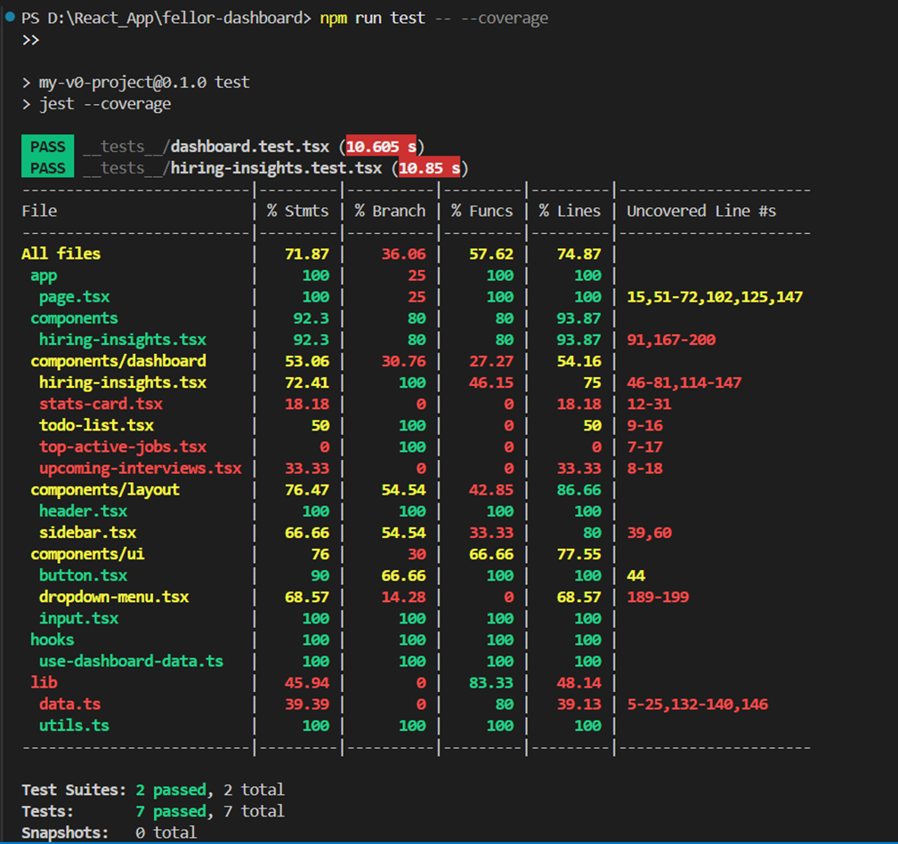

# Hiring Insights Dashboard

A modern, enterprise-grade hiring management dashboard built with **Next.js 14**, **TypeScript**, and **React Query**. It offers an intuitive interface for managing candidates, jobs, interviews, and hiring analytics.

- **Status**: Production Ready
- **Version**: Next.js 14.1.0 | TypeScript 5.0 | React Query 5.17.15

## Features

- 📊 **Dashboard Analytics**: Real-time hiring insights with interactive charts (powered by Chart.js and Recharts).
- 📱 **Responsive Design**: Fully mobile-optimized layout for seamless use across devices.

## Tech Stack
- **Frontend**: Next.js 14 + React 18 + TypeScript 5
- **Styling**: Tailwind CSS + shadcn/ui + Radix UI
- **Data & State**: Chart.js, Recharts, React Query, React Hook Form
- **Data Simulation**: Mocked JSON file for backend simulation

## Getting Started

### Prerequisites
- Node.js (v18 or later)
- npm or yarn

### Installation
1. Clone the repository:

   git clone https://github.com/MuhammadAkil/feller.git
   
   cd feller

### Install dependencies:

npm install
# or
npm i -f

Set up the environment file:

cp .env.example .env.local
Update .env.local with any required environment variables (e.g., API keys, if applicable).

### Start the development server:

npm run dev
Visit http://localhost:3000.

### Testing
Run the following commands to execute tests:

Run all tests:
npm run test
Watch mode (for continuous testing):
npm run test:watch

Generate coverage report:

npm run test:coverage

Test Summary (as of June 27, 2025): All test cases have passed successfully with coverage reports provided.

### Project Structure

├── app/              # Next.js App Router pages and layouts
├── components/       # Reusable React components
├── constants/        # Application constants and configurations
├── data/             # Mocked JSON data (e.g., hiring-insights.json)
├── hooks/            # Custom React hooks
├── lib/              # Utility functions and helpers
├── services/api/     # API service layer
├── types/            # TypeScript type definitions
├── __tests__/        # Test files

### Build & Deploy
Build Commands Run

npm run build
Start the production server:

Run
npm run start

### Deployment
Recommended: Deploy via Vercel. Connect your GitHub repository and enable auto-deployment on push.
Ensure environment variables are configured in the deployment provider.
License
This project is licensed under the MIT License.

### Developer Note
This dashboard was built with a focus on clean code, component reusability, and testable architecture. All test cases have passed successfully, with coverage reports available. Contributions and feedback are welcome!
